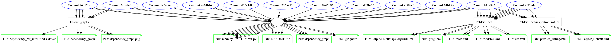

#  GIT

Инструмент командной строки для построения и визуализации графа зависимостей коммитов в git-репозитории. Граф отображает связи между коммитами, папками и файлами, используя представление **PlantUML**. Зависимости отображаются только для коммитов, выполненных после указанной даты.

---

## Установка и запуск

### Клонируйте репозиторий:
```bash
git clone https://github.com/AleksUon/Configuration-management-2
```

Для Windows:
```editorconfig
python -m venv venv
.\venv\Scripts\activate
pip install graphviz pytz lxml
```

Для Linux/UNIX/MAC:
```editorconfig
python -m venv venv
source venv/bin/activate
pip install graphviz pytz lxml
```

# Настройка config.xml

```editorconfig
<config>
    <repo_path>path_to_your_repo</repo_path>
    <output_path>output_graph</output_path>
    <commit_date>YYYY-MM-DD</commit_date>
</config>
```

* `repo_path`: Путь к анализируемому git-репозиторию.
* `output_path`: Имя файла-результата (без расширения).
* `commit_date`: Дата, начиная с которой анализируются коммиты.

# Что делает инструмент?
* Считывает настройки из конфигурационного файла config.xml.
* Анализирует git-репозиторий, начиная с указанной даты.
* Строит граф зависимостей, включающий:
  1. Коммиты (как узлы).
  2. Папки и файлы (как связанные узлы).
  3. Генерирует граф в формате PlantUML (по умолчанию выводится в консоль).

# Галерея


